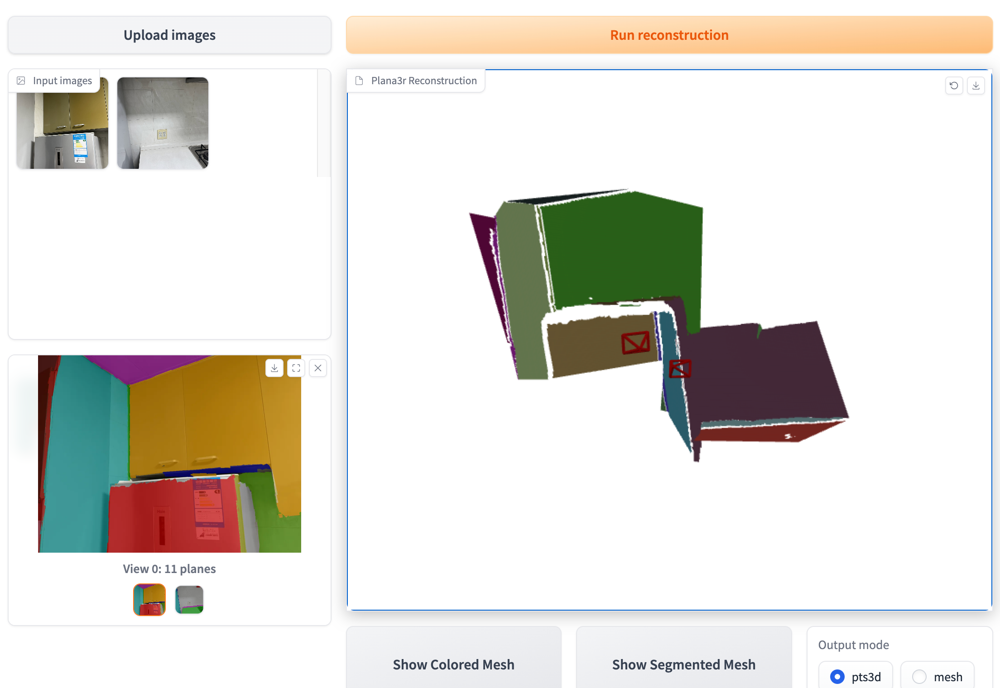

<div align="center">
<h1>PLANA3R: Zero-shot Metric Planar 3D Reconstruction via Feed-forward Planar Splatting</h1>

<a href="https://lck666666.github.io/plana3r/Plana3r_NeurIPS_2025.pdf" target="_blank" rel="noopener noreferrer">
  
</a>
<a href="https://arxiv.org/abs/2510.18714"></a>
<a href="https://lck666666.github.io/plana3r/"></a>
<a href='https://huggingface.co/DavidCSE/plana3r'></a>


[Changkun Liu<sup>1,2</sup>*](https://lck666666.github.io/), [Bin Tan<sup>2</sup>*](https://icetttb.github.io/), [Zeran Ke<sup>2,3</sup>](https://calmke.github.io/), [Shangzhan Zhang<sup>2,4</sup>](https://openreview.net/profile?id=~Shangzhan_Zhang1), [Jiachen Liu<sup>5</sup>](https://jcliu0428.github.io/), [Ming Qian<sup>2,3</sup>](https://qianmingduowan.github.io/),<br>
[Nan Xue<sup>2†</sup>](https://xuenan.net/), [Yujun Shen<sup>2</sup>](https://shenyujun.github.io/), [Tristan Braud<sup>1</sup>](https://braudt.people.ust.hk/)
</div>

<div align="center">
<sup>1</sup>HKUST; <sup>2</sup>Ant Group; <sup>3</sup>WHU; <sup>4</sup>ZJU; <sup>5</sup>PSU
</div>

<small>*Equal Contribution; <sup>†</sup>Corresponding author</small>


```bibtex
@inproceedings{
liu2025plana3r,
title={PLANA3R: Zero-shot Metric Planar 3D Reconstruction via Feed-forward Planar Splatting},
author={Changkun Liu and Bin Tan and Zeran Ke and Shangzhan Zhang and Jiachen Liu and Ming Qian and Nan Xue and Yujun Shen and Tristan Braud},
booktitle={The Thirty-ninth Annual Conference on Neural Information Processing Systems},
year={2025},
url={https://openreview.net/forum?id=YTwRZP8mNO}
}
```

## 📅 Updates

- [Oct 22, 2025] An improved new model, PLANA3Rv2, which outputs 3D planes without requiring image camera intrinsics, has been released and achieves improved results.
- [Oct 22, 2025] Code and pre-trained model is available.

## 📖 Overview
PLANA3R is an end-to-end transformer-based model for two-view metric 3D reconstruction and metric relative pose estimation, specifically designed for structured indoor scenes. It represents scenes using sparse 3D planar primitives. 

We build upon planar primitives introduced in [PlanarSplatting](https://github.com/ant-research/PlanarSplatting), and leverage its CUDA-based differentiable renderer for supervision. Therefore, even if what it directly outputs is sparse planar primitives, it still supports the dense depth/normal rendering.

## ⚙️ Installation
### 1. Clone PLANA3R

### 2. Create the enviroment
```
# cuda 12.1, python 3.8, torch 2.4.1

conda create -n plana3r python=3.8

# install pytorch
pip install torch==2.4.1 torchvision==0.19.1 torchaudio==2.4.1 --index-url https://download.pytorch.org/whl/cu121

# install pytorch3d
pip install "git+https://github.com/facebookresearch/pytorch3d.git@stable"

# install deps
pip install -r requirements.txt

# install diff_rect_rasterization
pip install planar_splatting/submodules/diff-rect-rasterization

```

## 🎯 Quick Start
### 1. Checkpoints
We provide several pre-trained models:
| Modelname   | Head |Input Support
|-------------|------|------|
| [`PLANA3Rv2.pth`](https://huggingface.co/DavidCSE/plana3r/resolve/main/plana3r_v2_official.pth) | camera FoVs; relative camera poses; parameters of planar primitives; points map |Uncalibrated & unposed images|
| [`PLANA3R.pth`](https://huggingface.co/DavidCSE/plana3r/resolve/main/plana3r_v1_official.pth) | relative camera poses; parameters of planar primitives |Unposed images with intrinsics|

The `PLANA3Rv2.pth` model incorporates two additional heads, leading to performance improvements as detailed in [Section: Features of Improved Model](##features-of-improved-model).

### 2. Gradio Demo
You can run PLANA3R with an interactive demo for your own data as follows:
```bash
python demo.py
```
<div align="center">
  
</div>

## 📜 Features of Improved Model
Referring to [VGGT](https://github.com/facebookresearch/vggt) and [DUSt3R](https://github.com/naver/dust3r), we have added points map head and FoV head to the model. During training, these heads can be supervised using loss functions similar to those employed in DUSt3R and VGGT, allowing the model to handle uncalibrated and unposed images directly. 

The codes for PLANA3R and PLANA3Rv2 are respectively located at `plana3r/model_plana3r_v1.py` and `plana3r/model_plana3r_v2.py`. The table below shows performance improvements using the same data and hyperparameters.

### Performance Comparison on ScanNetV2 and MP3D

The best results are in **bold**.  

| Dataset     | Method        | Trans. Med. (m)↓ | Trans. Mean (m)↓ | ≤1 (%)↑ | ≤0.5 (%)↑ | ≤0.1 (%)↑ | Rot. Med. (°)↓ | Rot. Mean (°)↓ | ≤30 (%)↑ | ≤15 (%)↑ | ≤5 (%)↑ | Chamfer ↓ | F-score ↑ |
|-------------|---------------|------------------|------------------|---------|-----------|-----------|----------------|----------------|----------|----------|---------|-----------|-----------|
| ScanNetV2   | SparsePlanes  | 0.56             | 0.81             | 73.7    | 44.6      | --        | 15.46          | 33.38          | 70.5     | 48.7     | --      | --        | --        |
|             | PlaneFormers  | 0.55             | 0.81             | 75.3    | 45.5      | --        | 14.34          | 32.08          | 73.2     | 52.1     | --      | --        | --        |
|             | NOPE-SAC      | 0.41             | 0.65             | 82.0    | 59.1      | 5.01      | 8.27           | 22.12          | 82.6     | 73.2     | 25.03   | 0.26      | 61.86     |
|             | MASt3R        | 0.11             | 0.19             | 97.65   | 93.98     | 47.37     | 2.17           | 6.67           | 95.04    | 94.08    | 84.37   | 0.21      | 74.92     |
|             | **PLANA3R**      | **0.07**         | **0.13**         | **98.62** | **97.16** | **67.91** | **2.01**       | **3.16**       | **99.23** | **98.89** | **93.14** | **0.11**  | **92.52** |
|             | **PLANA3Rv2**      | **0.06**         | **0.13**         | **98.57** | **97.28** | **69.69** | **1.84**       | **2.99**       | **99.21** | **98.86** | **93.73** | **0.10**  | **93.16** |
| Matterport3D| SparsePlanes  | 0.62             | 1.10             | 67.32   | 40.67     | 3.67      | 7.27           | 22.11          | 84.15    | 73.60    | 36.94   | 0.47      | 48.59     |
|             | NOPE-SAC      | 0.53             | 0.91             | 73.60   | 47.82     | 4.14      | 2.79           | 13.81          | 89.71    | 87.41    | 69.83   | 0.38      | 54.96     |
|             | MASt3R        | 0.41             | 0.59             | 85.20   | 58.87     | 8.55      | **0.98**       | 4.66           | 96.58    | 96.09    | **92.59** | 0.49      | 30.01     |
|             | **PLANA3R**      | **0.24**         | **0.45**         | **92.78** | **78.83** | **15.07** | 2.00           | **4.49**       | **98.01** | **97.19** | 89.82   | **0.32**  | **56.63** |
|             | **PLANA3Rv2**      | **0.23**         | **0.43**         | **93.28** | **79.98** | **17.08** | 1.68           | **4.03**       | **98.22** | **97.30** | 91.80   | **0.27**  | **61.55** |

## Todo

- [ ] Release the training code


## 🙏 Acknowledgements 
This work was supported by Ant Group Research Intern Program and Ant Group Postdoctoral Program. This project is developed based on several fantastic repos:

- [DUSt3R](https://github.com/naver/dust3r)
- [MASt3R](https://github.com/naver/mast3r)
- [PlanarSplatting](https://github.com/ant-research/PlanarSplatting)
- [VGGT](https://github.com/facebookresearch/vggt)
- [Nope-SAC](https://github.com/IceTTTb/NopeSAC)
- [3DGS](https://github.com/graphdeco-inria/gaussian-splatting)
- [Metric3Dv2](https://github.com/YvanYin/Metric3D)

We are extremely grateful for the contributions of these projects and their communities, whose hard work has greatly propelled the development of the field and enabled our work to be realized.